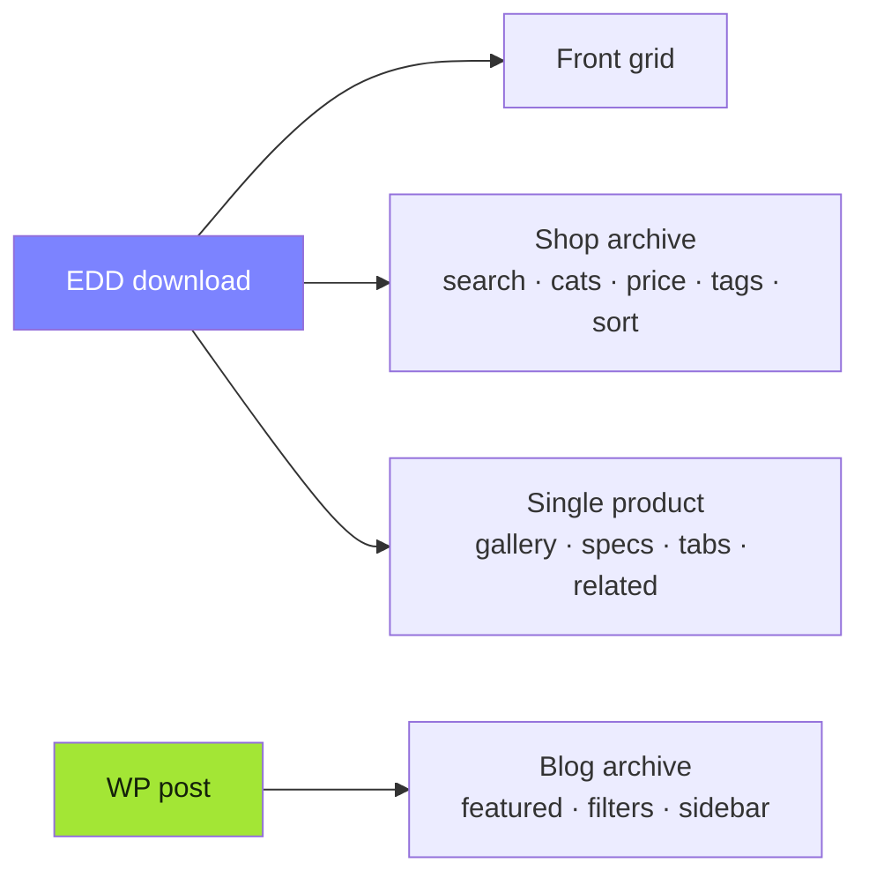

<!-- ╔══════════════════════════════════════════════════════════════════╗ -->
<!-- ║                            lavtheme                                ║ -->
<!-- ╚══════════════════════════════════════════════════════════════════╝ -->

<div align="center">


<a href="https://github.com/morpheusadam/wptheme">
  
</a>

<br/>

<!-- ░░░░░░░░░░░░░░░░░░░░  BADGES  ░░░░░░░░░░░░░░░░░░░░ -->
<p>
  
  
  
  
</p>
<p>
  
  
  
  
  
</p>

</div>

---

<div align="center">

### ✦ &nbsp; A landing page you can re-code from the dashboard &nbsp; ✦

</div>

> **lavtheme** is a classic (PHP-template) WordPress theme built from a single-page
> glassmorphism design — transferred *verbatim*, then split into editable sections.
> Its centerpiece is **Theme Code Studio**: edit the HTML/PHP · CSS · JS · Mobile CSS · PHP
> of **every section, page, product, the shop and the blog** — live, from `wp-admin`,
> with database-safe injection (never white-screens) or opt-in file writes.

---

## 📑 Table of Contents

- [✨ Features](#-features)
- [🧠 Architecture](#-architecture)
- [🧩 Theme Code Studio](#-theme-code-studio)
- [🛒 Commerce & Content](#-commerce--content)
- [🛰️ Backlink Spam Checker](#️-backlink-spam-checker)
- [🚀 Install](#-install)
- [🛡️ Safety model](#️-safety-model)
- [🧰 Tech stack](#-tech-stack)
- [📊 Activity](#-activity)

---

## ✨ Features

<table>
  <tr>
    <td width="50%" valign="top">

#### 🎛️ Live Code Studio
Edit **every** section's code in `wp-admin` — HTML/PHP, CSS, JS, Mobile CSS & a guarded PHP tab. Drag to reorder, add/rename/delete, trash & restore.

#### 🧱 Dynamic section registry
Sections aren't hardcoded — they live in `wp_options`. Front page, **every page**, single product, shop & blog each get their own editable context.

#### 🛍️ Easy Digital Downloads
Real product grid, category bubbles, a full **shop archive** (search, multi-category, price slider, tags, sort) and a rich **single-product** template — all server-side & SEO-safe.

    </td>
    <td width="50%" valign="top">

#### 🪄 Database-safe injection
Code is stored in options and injected at render — **the site can never white-screen**. File mode (opt-in, locked behind a constant) writes to disk with auto-backup + syntax check.

#### 📰 Blog engine
`blog.html` design wired to real posts: featured post, category pills, sort (latest/popular/read-time/A–Z), date & author filters, sidebar widgets — pixel-perfect.

#### 🛰️ Backlink Spam Checker
A standalone admin tool that streams results **live** via Server-Sent Events, with an automatic AJAX-polling fallback, and exports a Google **disavow** file.

    </td>
  </tr>
</table>

---

## 🧠 Architecture

```mermaid
flowchart TD
    FP["functions.php<br/>bootstrap"] --> HLP["inc/helpers.php"]
    FP --> SET["inc/setup.php"]
    FP --> ENQ["inc/enqueue.php<br/>inline split CSS"]
    FP --> EDD["inc/edd*.php<br/>products · shop · single"]
    FP --> BLOG["inc/blog*.php<br/>archive engine"]
    FP --> CS["inc/code-studio*.php<br/>registry · save · inject · pages · dl · shop · blog"]
    FP --> BLC["inc/backlink-checker.php<br/>SSE tool"]

    subgraph ADMIN["🖥️ wp-admin"]
      CS -->|CodeMirror + AJAX| PANEL["Code Studio panel"]
    end

    subgraph DB[("wp_options")]
      OPT["lavtheme_cs_*<br/>registries + per-section code"]
    end
    PANEL -->|save| OPT

    subgraph FRONT["🌐 front-end"]
      direction LR
      HEAD["wp_head → CSS"] --- BODY["template-parts/*"] --- FOOT["wp_footer → JS"]
    end
    OPT -->|read at render| FRONT
    BLOG --> FRONT
    EDD --> FRONT

    classDef core fill:#7c83ff,stroke:#fff,color:#fff;
    classDef store fill:#22d3ee,stroke:#fff,color:#06303a;
    class FP,CS,BLC core;
    class OPT store;
```

**Flow:** admin edits in Code Studio → AJAX → saved to `wp_options` (or, in File mode, theme files) → on the front end the injectors read those options and emit CSS in `wp_head`, JS in `wp_footer`, and section markup into the page — keeping the original design **pixel-perfect**.

---

## 🧩 Theme Code Studio

| Capability | What it does |
|---|---|
| **Per-section editors** | HTML/PHP · CSS · JS · Mobile CSS (`@media ≤640`) · guarded PHP |
| **Global & Schema** | `:root` vars, global CSS/JS/background, and JSON-LD per context |
| **Contexts** | Front Page · every published Page · Single Download (template) · Shop (archive) · Blog (archive) |
| **Placement** | `inline` · `sidebar-left/right` · `replace` · `wrap` (responsive grid) |
| **Save modes** | **Database** (safe live inject, default) · **File** (disk write, backup + lint, opt-in) |
| **Import / Export** | Versioned JSON per section — re-imported through the same guarded save path |
| **Reset / Restore / Trash** | One-click reset to file default, one-step undo, restorable section trash |

> Editor: WordPress' bundled **CodeMirror** — dark skin, folding, bracket matching, `Ctrl-Space` autocomplete.

---

## 🛒 Commerce & Content



- **Dynamic shop URL** — read from EDD's `products_page`; never hardcoded.
- **Server-side filtering** — plain `GET` params on the real query → works with JS off, SEO-friendly.
- **No plugin template overrides** — restyle via CSS / wrap with custom sections; update-safe.

---

## 🛰️ Backlink Spam Checker

A self-contained admin tool at **Tools → Backlink Spam Checker** — zero front-end footprint.

```
#12/40  SPAM       cheap-casino-poker-bonus.xyz [0]  — High-risk TLD .xyz, 3 spam keywords, 3 hyphens
#13/40  CLEAN      example.com [200]  — No spam signals detected
#14/40  SUSPICIOUS foo-links.top | buy seo  — High-risk TLD .top, Suspicious anchor text
```

- **Live, line-by-line** output via **Server-Sent Events** (`text/event-stream`, buffering & gzip disabled, `X-Accel-Buffering: no`, 2 KB anti-buffer padding).
- **Auto-fallback to AJAX polling** if the host (CDN/LiteSpeed) buffers the stream — the client detects no events within 6 s and switches mid-run.
- **Heuristics:** risky TLDs, spam keywords, hyphen/digit ratios, long labels, suspicious anchor text + HTTP reachability (5 s timeout).
- **Export** a ready-to-use Google **disavow** `.txt` (`domain:example.com`).

---

## 🚀 Install

```bash
# Into your WordPress themes directory:
cd wp-content/themes
git clone https://github.com/morpheusadam/wptheme.git lavtheme
```

Then **Appearance → Themes → Activate**. Optional power-ups in `wp-config.php`:

```php
define( 'LAVTHEME_ALLOW_FILE_WRITE',   true ); // enable File save mode
define( 'LAVTHEME_ALLOW_PHP_SECTIONS', true ); // run the per-section PHP tab
```

> Requires **WordPress 6.0+** and **PHP 8.1+**. Easy Digital Downloads is optional (the theme degrades gracefully).

---

## 🛡️ Safety model

- 🔒 **Never white-screens** — DB mode injects code; a bad PHP tab is syntax-checked & sandboxed in `try/catch`.
- 🧪 **Real lint** — `token_get_all( …, TOKEN_PARSE )` (shell-free).
- 🧯 **Auto-backups** — every file write & PHP save snapshots the previous value.
- 🧹 **Secrets stay out of git** — credentials, `.vscode/`, `wp-config.php` & `.backups/` are git-ignored.

---

## 🧰 Tech stack

<div align="center">


</div>

---

## 📊 Activity

<div align="center">


<br/>


<br/>


</div>

---

<div align="center">


<sub>Built with 🩵 for <b>lavzen.com</b> · Theme Code Studio · Easy Digital Downloads · GPL-2.0</sub>

</div>
